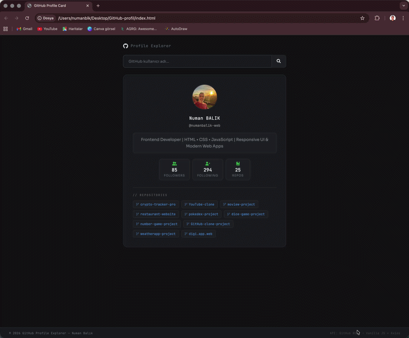
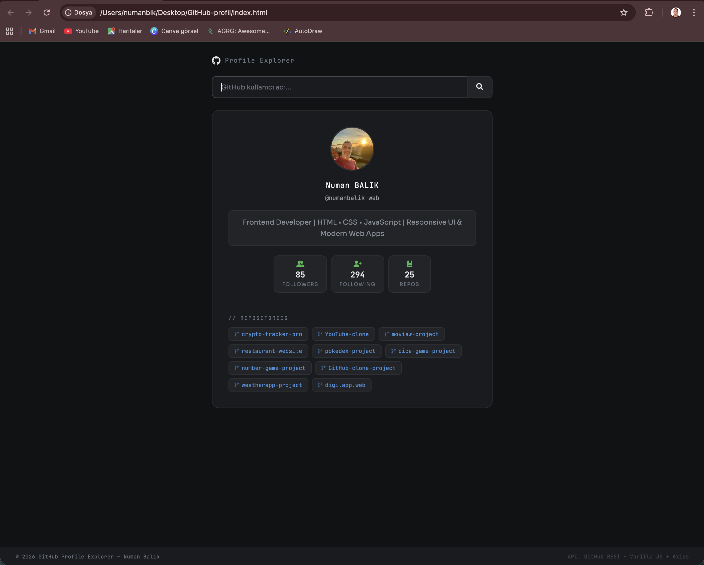

# 🪪 GitHub Profile Card

A modern GitHub profile card application that allows users to search and display GitHub user information in a clean and responsive UI.

---

## 🚀 Overview

This project fetches real-time data from the GitHub API and presents user profiles in a visually appealing card format.

It is designed to simulate real-world API usage and improve frontend data handling skills.

---

## 🧠 Features

- 🔍 Search GitHub users by username  
- 👤 Display profile information dynamically  
- ⚡ Fast and responsive interface  
- 📱 Fully responsive design  
- 🌐 API integration (GitHub API)  
- 🎨 Clean and modern UI  

---

## 🖥️ Preview

Simple and clean user interface for searching profiles.

---

## 🛠️ Tech Stack

- HTML5  
- CSS3  
- JavaScript (ES6+)  
- GitHub API  

---

## ⚙️ Installation & Run

git clone https://github.com/yourusername/github-profile-card.git  
cd github-profile-card  
open index.html  

---

## 👨‍💻 Author & Contact

  
  
  

  🚀 Open to Frontend Developer opportunities  

---

## 🙏 Acknowledgment

Special thanks to my instructor **https://github.com/isveckrali** and the **https://github.com/Udemig** team.
